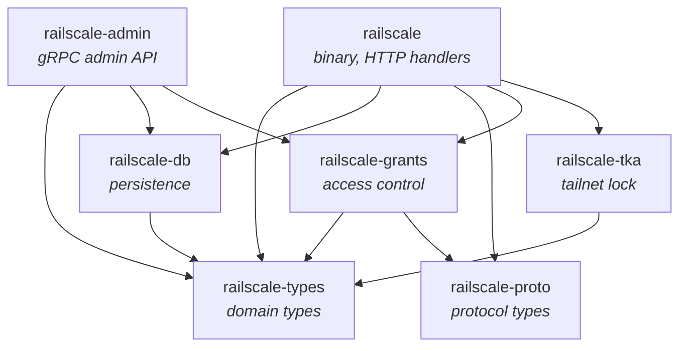
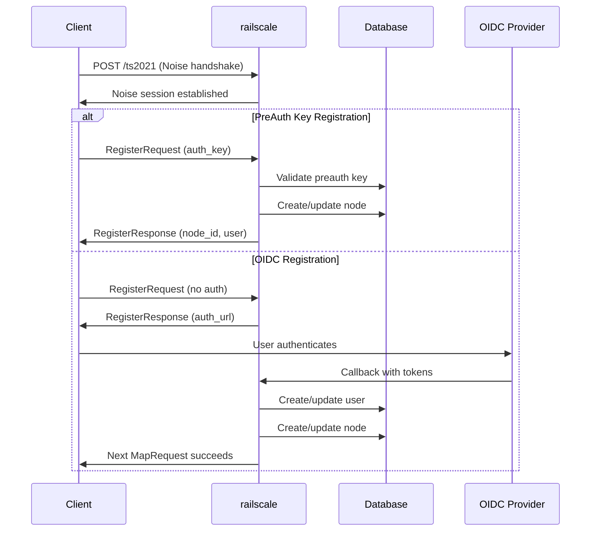
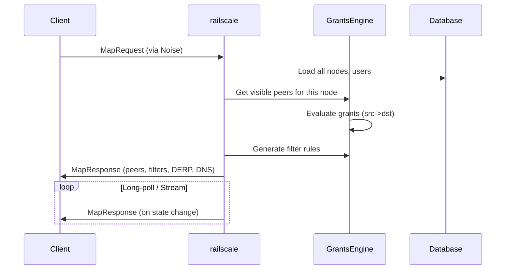

# Railscale Architecture

> note: i just got claude to generate this. it might be Very wrong

Self-hosted Tailscale control server implementation in Rust with grants-based access control.

## High-Level Overview

```
                                    +------------------+
                                    |  Tailscale       |
                                    |  Clients         |
                                    +--------+---------+
                                             |
                           HTTPS (ts2021 protocol)
                                             |
                                             v
+-------------------+              +-------------------+
|  Admin CLI        |----(gRPC)-->|    railscale      |
|  (railscale-admin)|             |    (main binary)  |
+-------------------+              +--------+----------+
                                           |
         +------------+------------+-------+-------+------------+------------+
         |            |            |               |            |            |
         v            v            v               v            v            v
  +------+----+ +-----+------+ +---+----+ +-------+------+ +----+-----+ +----+-----+
  | -types    | | -db        | | -proto | | -grants      | | -admin   | | -tka     |
  | (domain)  | | (storage)  | | (wire) | | (policy)     | | (grpc)   | | (lock)   |
  +-----------+ +------------+ +--------+ +--------------+ +----------+ +----------+
```

## Crate Dependency Graph



## Crate Responsibilities

### `railscale` (main binary)

The HTTP server and CLI interface. Built with axum.

**Key components:**
- `handlers/` - HTTP request handlers for Tailscale protocol
  - `map.rs` - MapRequest/MapResponse (network state sync)
  - `register.rs` - Node registration
  - `oidc.rs` - OpenID Connect authentication flow
  - `ts2021.rs` - Noise protocol WebSocket upgrade
  - `api_v1/` - REST admin API endpoints
- `cli/` - Command-line interface (serve, users, nodes, policy, lock)
- `resolver.rs` - User/group resolution for grants evaluation
- `derp.rs` / `derp_server.rs` - DERP relay integration
- `presence.rs` - Tracks connected nodes for online status
- `ephemeral.rs` - Garbage collector for inactive ephemeral nodes

**Application state (`AppState`):**
```rust
pub struct AppState {
    pub db: RailscaleDb,
    pub grants: Arc<RwLock<GrantsEngine>>,  // Hot-reloadable
    pub config: Config,
    pub oidc: Option<AuthProviderOidc>,
    pub notifier: StateNotifier,            // Broadcasts to clients
    pub ip_allocator: Arc<Mutex<IpAllocator>>,
    pub derp_map: Arc<RwLock<DerpMap>>,
    pub presence: PresenceTracker,
    pub ephemeral_gc: EphemeralGarbageCollector,
    // ... caches, keys
}
```

### `railscale-types`

Domain types shared across all crates. No external service dependencies.

**Key types:**
- `Node` - Tailscale device (machine key, node key, IPs, tags, etc.)
- `User` - User account with optional OIDC binding
- `PreAuthKey` - Pre-authentication keys for automated registration
- `ApiKey` - API keys with split-token pattern for secure lookup
- `Config` - Application configuration
- `Tag` - Validated tag strings (`tag:name`)
- `NodeKey`, `MachineKey`, `DiscoKey` - Cryptographic key wrappers

**Test utilities:**
- `TestNodeBuilder` - Fluent builder for test fixtures

### `railscale-db`

Database layer using sea-orm. Supports SQLite and PostgreSQL.

**Key components:**
- `Database` trait - Abstract interface for storage operations
- `RailscaleDb` - sea-orm implementation
- `IpAllocator` - Sequential or random IP allocation from configured prefixes
- `entity/` - sea-orm entity definitions
- `migration/` - Database migrations

**Operations:**
- Soft-delete semantics (records marked with `deleted_at`)
- Split-token lookup for API keys
- Hash-based lookup for preauth keys
- TKA state and AUM storage

### `railscale-proto`

Tailscale wire protocol types and Noise cryptography.

**Key types:**
- `MapRequest` / `MapResponse` - Client state synchronisation
- `FilterRule` - Packet filter rules sent to clients
- `DerpMap`, `DerpRegion`, `DerpNode` - Relay configuration
- `SshPolicy`, `SshRule` - Tailscale SSH configuration
- `NoiseHandshake` / `NoiseTransport` - ts2021 encryption

**Serde conventions:**
- Go PascalCase for JSON field names (client compatibility)
- Skip serialising None/empty fields

### `railscale-grants`

Grants-based access control engine (Tailscale's ACL replacement).

**Key types:**
- `Policy` - Complete policy document (grants + SSH rules + groups + postures)
- `Grant` - Single access rule (src -> dst with capabilities)
- `Selector` - Node matcher (`*`, `tag:x`, `user@`, `group:`, CIDR, autogroups)
- `NetworkCapability` - Port/protocol permissions
- `GrantsEngine` - Thread-safe policy evaluator
- `PostureExpr` - Device posture conditions
- `GeoIpResolver` - Geolocation lookup for ip:country posture checks

**Selectors:**
```
*                    - All nodes
tag:web              - Nodes with tag:web
autogroup:tagged     - Any tagged node
autogroup:member     - Any user-owned (untagged) node
autogroup:self       - Same user's other devices
user@example.com     - Nodes owned by this user
group:engineering    - Nodes owned by group members
100.64.0.0/24        - Nodes with IP in CIDR
```

**Evaluation:**
- Deny-by-default
- Union composition (multiple matching grants combine)
- Directional (src -> dst, not bidirectional)

### `railscale-tka`

Tailnet Key Authority (tailnet lock) implementation.

**Key types:**
- `Authority` - TKA state machine
- `Aum` - Authority Update Message (signed state changes)
- `Key` - TKA signing key (ed25519)

**Features:**
- Genesis AUM creation with configurable disablement secrets
- Full AUM chain storage and sync
- Node signing with `nlpriv:` key format
- TKA disable with disablement secret

### `railscale-admin`

gRPC admin service for CLI and remote administration.

**Transport:** Unix socket (`/run/railscale/admin.sock`)

**Services:**
- Policy management (get, set, reload)
- User CRUD
- Node management (list, delete, expire, tags, routes)
- PreAuth key management
- API key management
- TKA operations (init, sign, disable)

## Data Flow

### Node Registration



### Map Request (State Sync)



## Key Architectural Decisions

### 1. Grants vs ACLs

Railscale uses Tailscale's newer grants system instead of legacy ACLs:
- More expressive selectors (groups, autogroups, posture)
- Clearer composition (union semantics)
- Better support for app-level permissions

### 2. Hot-Reloadable Policy

The `GrantsEngine` is wrapped in `Arc<RwLock<>>` allowing policy updates without restart:
```rust
pub struct PolicyHandle {
    engine: Arc<RwLock<GrantsEngine>>,
}
```

Reload via SIGHUP, admin API, or CLI command.

### 3. Split API Architecture

When `api.listen_host` is configured, REST API runs on separate port:
- Protocol endpoints (ts2021, map, register) on public port
- Admin API on internal/localhost port
- Better security boundary

### 4. Noise Protocol (ts2021)

Modern Tailscale clients use Noise IK protocol over WebSocket:
- Mutual authentication via machine keys
- Forward secrecy
- Replay protection

Legacy HTTP-based protocol not supported.

### 5. IP Allocation

Sequential or random allocation from configured prefixes:
- IPv4: Default `100.64.0.0/10` (CGNAT range)
- IPv6: Default `fd7a:115c:a1e0::/48` (ULA range)
- Allocator tracks used IPs, loads from DB on startup

### 6. Soft Deletes

All entities use soft-delete with `deleted_at` timestamp:
- Preserves audit trail
- Allows recovery
- Simplifies foreign key handling

### 7. Ephemeral Nodes

Nodes created with ephemeral preauth keys are automatically deleted after inactivity:
- `EphemeralGarbageCollector` tracks disconnects via presence
- Configurable timeout (default 120s)
- Deletion cancelled if node reconnects

## External Dependencies

### Cryptography
- `snow` - Noise protocol implementation (vendored with patches)
- Standard library crypto for key generation

### Authentication
- `openidconnect` - OIDC client implementation
- Supports any OIDC-compliant provider (Keycloak, Auth0, etc.)

### Database
- `sea-orm` - Async ORM with migration support
- SQLite for development/small deployments (with WAL mode)
- PostgreSQL for production

### HTTP
- `axum` - Web framework
- `tower-governor` - Rate limiting
- `tonic` - gRPC (admin service)

### Geolocation
- `maxminddb` - GeoLite2-Country database for ip:country posture checks

## Testing Strategy

### Unit Tests
Each crate has unit tests for core logic:
- Grants evaluation
- Selector parsing
- Posture expression parsing
- Database operations
- Protocol encoding

### Integration Tests
`crates/railscale/tests/` contains protocol-level tests:
- `ts2021_*_test.rs` - Noise handshake tests
- `map_*_test.rs` - MapRequest/Response tests
- `register_test.rs` - Registration flow tests
- `oidc_test.rs` - OIDC authentication tests

### VM Tests (NixOS)
Full end-to-end tests in NixOS VMs:
- Real Tailscale client connecting to railscale
- Multi-node scenarios
- Policy enforcement verification
- Taildrop file transfers
- Tailnet lock operations

Run via `nix flake check` (can take 5-10 minutes).
